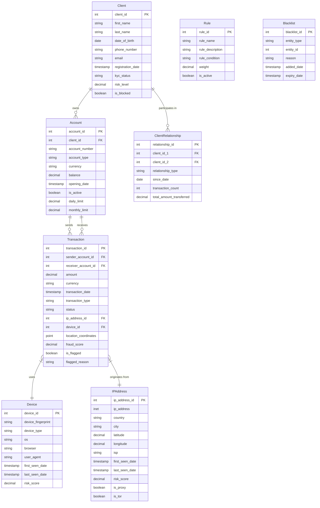

# Визуализация Базы Данных

Ниже представлена ER-диаграмма (Entity-Relationship) базы данных антифрод системы.
Вы можете открыть предварительный просмотр этого файла в VS Code (Ctrl+K V), чтобы увидеть отрендеренную диаграмму.

